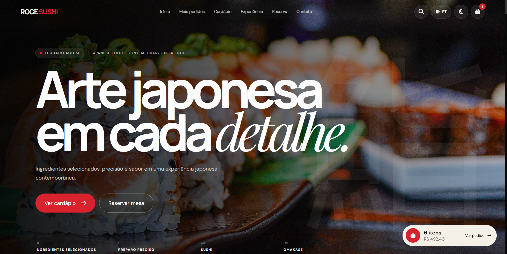

# 🍣 ROGE Sushi

<div align="center">



### Modern Japanese Restaurant Website

A modern and responsive restaurant website developed with **HTML, CSS and JavaScript**.

<br>

[🌐 Live Demo](https://rogesushioficial.netlify.app/)

</div>

---

## 📌 About

**ROGE Sushi** is a modern Japanese restaurant website designed to create an immersive and responsive digital experience.

The project combines a visually focused interface with interactive elements and a structured navigation system, creating a complete restaurant website concept.

The main goal was to develop a polished frontend experience while practicing **HTML structure, CSS styling, responsive layouts and JavaScript interactions**.

---

## ✨ Features

- 📱 Responsive interface
- 🍣 Japanese restaurant themed design
- 🧭 Structured navigation
- 🔎 Interactive interface elements
- 🛒 Shopping/cart interface
- 📋 Restaurant menu presentation
- 📅 Reservation section
- 📍 Contact section
- 🌙 Dark visual interface
- ⚡ JavaScript interactions
- 🎨 Custom visual design

---

## 🛠️ Technologies

<div align="center">


</div>

---

## 📂 Project Structure

```text
roge-sushi/
│
├── index.html
├── style.css
├── script.js
├── preview.png
└── README.md
